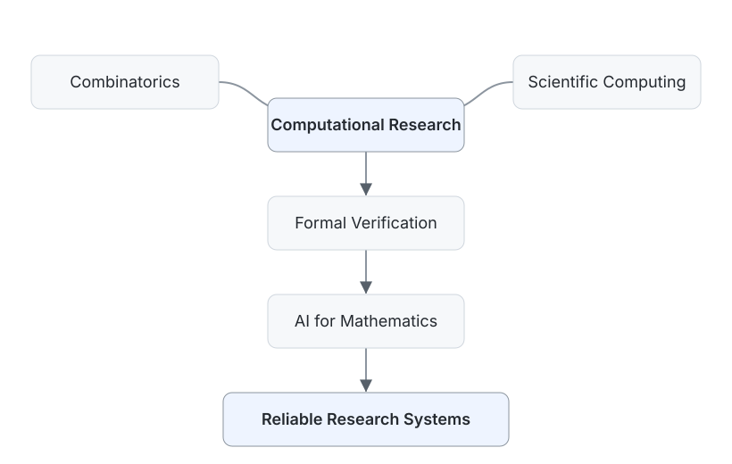

# Aki / Alan

  <strong>Mathematics × AI × Reliable Research Systems</strong>

  Combinatorics · AI4Math · Formal Verification · Scientific Computing

  Undergraduate in Information and Computing Science

  <picture>
    <source media="(prefers-color-scheme: dark)" srcset="assets/research-map-dark.svg">
    
  </picture>

## About

I work at the intersection of mathematics and AI, turning mathematical questions into reproducible computational artifacts, machine-checkable proofs, and auditable AI-assisted research workflows.

## Research Interests

**Primary:** `Combinatorics` · `AI for Mathematics` · `Formal Verification` · `Scientific Computing` 
**Supporting:** `Reliable AI Agents / Research Workflows` · `Computer Vision / Machine Learning`

## Selected Work

| Project | Area | Evidence |
| --- | --- | --- |
| [theta-nnn-one-lean](https://github.com/AlanAkillove/theta-nnn-one-lean) | Formal Mathematics | Lean 4 / Mathlib · paper-to-Lean map · machine-checkable proofs |
| [ProofForge](https://github.com/AlanAkillove/ProofForge) | AI4Math | falsification · Proof DAGs · Lean traces · artifact audits |
| [Manifold-Microchannel-Thermal-Optimization](https://github.com/AlanAkillove/Manifold-Microchannel-Thermal-Optimization) | Scientific Computing | surrogate validation · holdout checks · Pareto optimization |
| [MMSkills](https://github.com/AlanAkillove/MMSkills) | Research Workflows | problem-first modeling · independent review · deterministic QA |
| [CVLab](https://github.com/AlanAkillove/CVLab) | ML Systems | experiment tracking · diagnostics · CLI / web interface |

## Recent Work

- **September 2026** — [Manifold-Microchannel-Thermal-Optimization](https://github.com/AlanAkillove/Manifold-Microchannel-Thermal-Optimization) published an initial reproducible scientific-computing release and follow-up reproducibility notes.
- **September 2026** — [MMSkills](https://github.com/AlanAkillove/MMSkills) strengthened quality boundaries, independent review, and evidence-first writing checks.
- **July 2026** — [theta-nnn-one-lean](https://github.com/AlanAkillove/theta-nnn-one-lean) reached `v1.0.0` with a paper-to-Lean theorem guide.

## Community & Teaching

[ACM](https://github.com/AlanAkillove/ACM) — Algorithm and mathematical foundations knowledge base for CQUE-ACMers, including structured notes, derivations, and reference implementations.

## Contact

[Email](mailto:2577135531@qq.com) · [GitHub](https://github.com/AlanAkillove)
